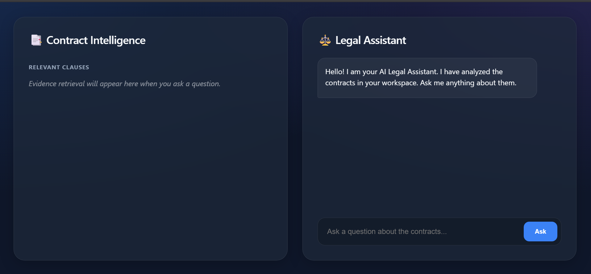
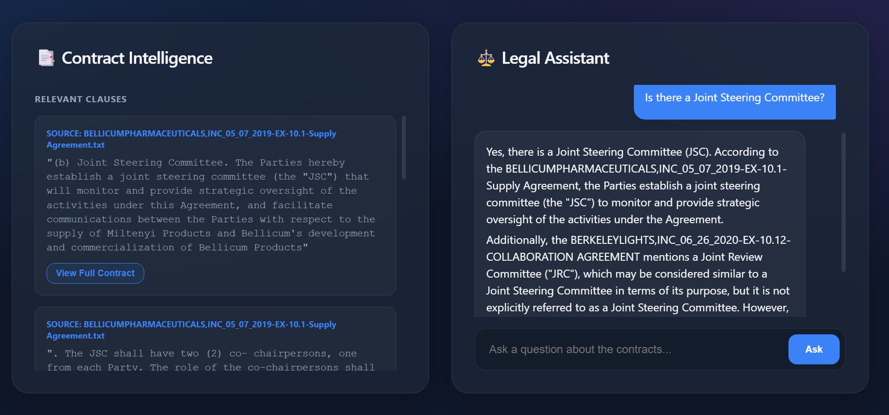
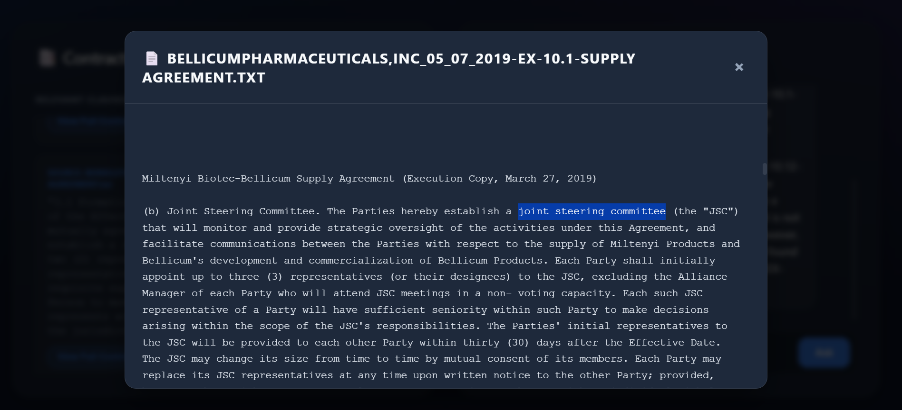

# ⚖️ Domain-Grounded Smart Legal Insight Engine

A high-performance RAG (Retrieval-Augmented Generation) application designed to analyze legal contracts and answer questions with citation-backed accuracy.

Built with **React (Glassmorphism UI)**, **FastAPI**, **FAISS Vector DB**, and powered by **Meta Llama 3** (via Groq) for lightning-fast inference.

## 🚀 Features

- **Document Analysis**: Ingests and indexes real-world legal contracts (PDF/TXT).
- **Smart Retrieval**: Uses FAISS vector search to find relevant clauses significantly faster than manual review.
- **AI-Powered Synthesis**: Integrates **Llama 3-70B** to generate lawyer-like answers based *only* on the provided evidence.
- **Evidence Highlighting**: Automatically highlights key terms in source documents for rapid verification.
- **Modern UI**: Sleek, responsive React frontend with a dark-mode Glassmorphism aesthetic.
- **Live Document Viewer**: Read full contract text securely within the app modal.

## 🛠️ Tech Stack

- **Frontend**: React.js, Vite, CSS Modules (Glassmorphism).
- **Backend**: FastAPI (Python), Uvicorn.
- **AI/LLM**: Groq API (running Llama 3-70B), LangChain (optional integration).
- **Vector DB**: FAISS (Facebook AI Similarity Search) - Local CPU execution.
- **Embeddings**: Sentence-Transformers (`all-MiniLM-L6-v2`).

## 📸 Screenshots

| **Dashboard Interface** | **AI-Generated Answer** |
|:---:|:---:|
|  |  |
| **Context Retrieval (FAISS)** | **Backend Logs** |
|  |  |

## ⚡ Quick Start

### Prerequisites
- Python 3.9+
- Node.js & npm
- [Groq API Key](https://console.groq.com/) (Free Tier available)

### 1. Clone the Repo
```bash
git clone https://github.com/parthkharade04/smart-legal-assistant.git
cd smart-legal-assistant
```

### 2. Backend Setup
```bash
cd backend
python -m venv venv
# Activate venv: `venv\Scripts\activate` (Windows) or `source venv/bin/activate` (Mac/Linux)
pip install -r requirements.txt

# Set up your Environment Variable
# Create a .env file in /backend and add:
# GROQ_API_KEY=your_key_here
```

### 3. Frontend Setup
```bash
cd frontend
npm install
npm run dev
```

### 4. Run the App
- **Backend**: `uvicorn main:app --reload --port 8000`
- **Frontend**: Open `http://localhost:3000`

## 🧠 How It Works using RAG

1. **Ingestion**: Uploaded contracts are chunked into 500-character segments.
2. **Embedding**: Text chunks are converted into vector embeddings using `SentenceTransformer`.
3. **Retrieval**: When you ask a question, the system finds the top 5 most similar chunks from the vector store.
4. **Generation**: The retrieved chunks + user question are sent to **Llama 3**, which synthesizes a grounded answer.

## 🛡️ License
MIT License.
